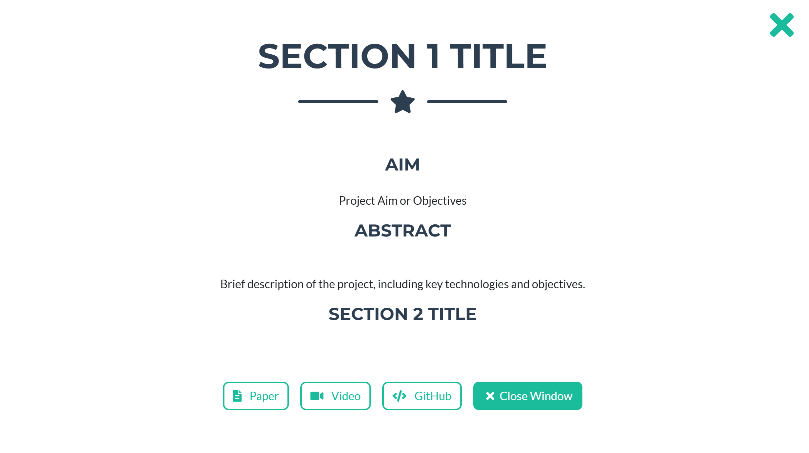

# My Personal Portfolio
## Easily Customizable for Your Own Use

This project provides a customizable personal portfolio built with Jekyll. Users can personalize their portfolio by simply editing markdown files—no coding required. Update personal details, content, and sections easily to create a unique, professional portfolio that reflects your identity, all with minimal effort.

Click here to visit the portfolio : [Portfolio](https://rohitlal.net/)

## Setting up Locally
Clone the repository and follow the below instructions

### For Mac Installation

``` bash
brew install ruby
gem install bundler jekyll
```

### For Windows Install 
- Download Ruby+Devkit [Link to Download](https://github.com/oneclick/rubyinstaller2/releases/download/RubyInstaller-3.3.5-1/rubyinstaller-devkit-3.3.5-1-x64.exe)
  
### Run

Install the dependencies:

``` bash
bundle install
```

Run the local webserver with:

``` bash
bundle exec jekyll serve
```


## Edit Personal details

* Update the [aboutme.yml](_data/lab_members.yml) file inside _data folder.
* Leave fields blank or comment them out for any information you don’t want to display.

For the best experience, ensure that you fill out the **Name**, **DP_Link**, **Area_Of_Expertise**, at least three social links, and the **About** section.

Sample Example
```yml
- Name: Your Name
  DP_Link: Your Pic
  Area_Of_Expertise: Web development | Software Development 
  Github : https://github.com/your_id/
  Email : mailto:your_email
  Twitter : https://twitter.com/your_id
  Instagram : https://www.instagram.com/your_id/
  Linkedin: https://www.linkedin.com/in/your_id/
  Scholar: https://scholar.google.com/citations?hl=en&user=your_id
  Work_Location : >
    Your Work Location
  Map_Location_Link : Embed a Google Maps link to your work address
  Resume_Link : Add link to your Resume
  About : >
    Give a brief description of yourself.
```

## Add/Update courses

* Update the [courses.yml](_data/courses.yml) file inside _data folder.

Sample Example
```yml
- title: Course_title
  certificate: Link to your certificate
  source: Any source (e.g. Coursera)
  source_url: https://www.coursera.org
  instructor: Instructor's Name
  instructor_url: Profile link for your instructor
```

* `instructor` & `instructor_url` are optional, but looks better when `certificate` is *not* available.

## Add/Update Experience

* Update the [experiences.yml](_data/experiences.yml) file inside _data folder.

Sample Example
```yml
- company: Your Company Name
  url: Company Website URL
  title: Your Job Title
  date: Start Date - End Date/Current
  location: City, Country
  description: >
    A brief description of what you did/are doing.
```

## Add/Update News

* Update the [news.yml](_data/news.yml) file inside _data folder.
* Set the value of `k` to the number of news items you want to display on the homepage.
* The rest of the news(leaving the top `k`) will be displayed in a pop-up window, when clicked on `See More` button.
* For each news item, add a new entry under the `news` list.

Sample Example
```yml
k: 6
news:
  - date: Date
    description: >
      A Brief description of the news.
```

* If `k` is left empty, it will default to 10 news items.

## Add/Update Patents

* Update the [patents.yml](_data/patents.yml) file inside _data folder.

Sample Example
```yml
- patent: Patent Title
  author: Author Names
  issued: Issue Date
  number: Patent Number
  file: Link to Patent Document
  video: Link to Demonstration Video
```

## Add/Update Projects

* Update the [projects.yml](_data/projects.yml) file inside _data folder.

Sample Example
```yml
- image: Path to Project Image
  title: Project Title
  modal: Modal Identifier
  abstract: >
    Brief description of the project, including key technologies and objectives.
  diagram: Path to Project Diagram
  section1_title: Section 1 Title
  section2_title: Section 2 Title
  paper: Link to Research Paper
  video: Link to Demonstration Video
  github: Link to GitHub Repository
  aim: Project Aim or Objectives
```

* For `modal`, just give a unique identifier of your project.
* The links to `paper`. `video`, `github` is optional and can be left blank, if not present.
* `diagram`, `section1_title`, `section2_title`, `aim` and `abstract` is displayed in a pop-up window, after clicking on the project image/title.
* For better understanding of the keys, refer the picture below



## Add/Update Publications/Research Works

* Update the [publications.yml](_data/publications.yml) file inside _data folder.

Sample Example
```yml
- paper: Paper Title
  author: Author Names
  pub: Publication Name
  type: Publication Type
  paper_link: Link to Paper
  project_page: Link to Project Page
  code_link: Link to Code Repository
  bibtex: BibTeX Entry
  video: Link to Video
```

All the links are optional.

## Add/Update skills

* Update the [skills.yml](_data/skills.yml) file inside _data folder.

Sample Example
```yml
- image: Link to an image/logo depicting the skill
  name: Name of the skill
```


## Tips & Troubleshoting

* If encountered an error while running `bundle install` locally, try deleting the `Gemfile.lock` file and try running the command again!

* **DO NOT** change the folder names, as this may break some parts or the whole website unless you know how jekyll works! [Jekyll Website](https://jekyllrb.com/).

* A youtube playlist that may give you a brief understanding of how jekyll works! [Giraffe Academy](https://youtube.com/playlist?list=PLLAZ4kZ9dFpOPV5C5Ay0pHaa0RJFhcmcB&si=VlMXzsKDYwPBWm1O)
